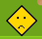
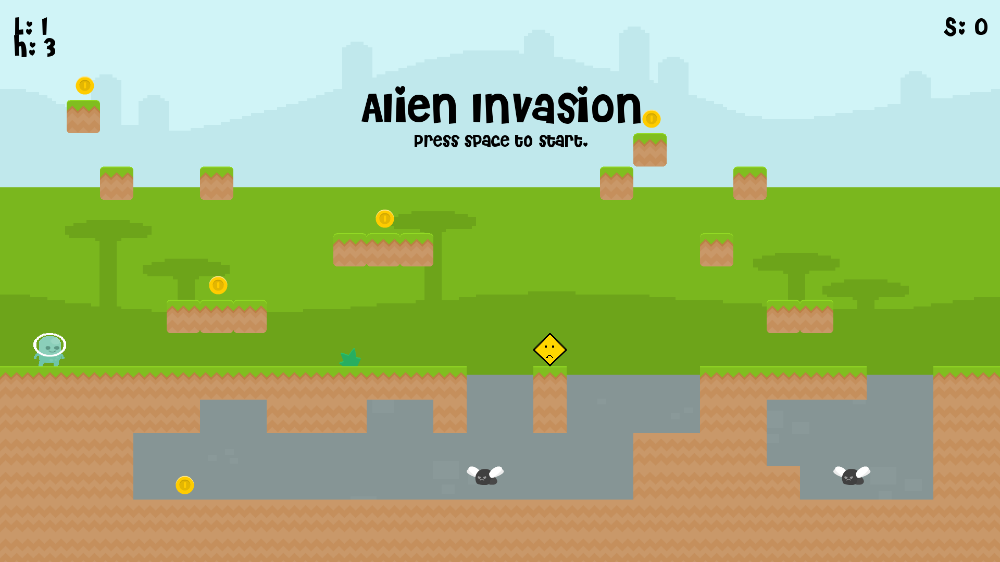
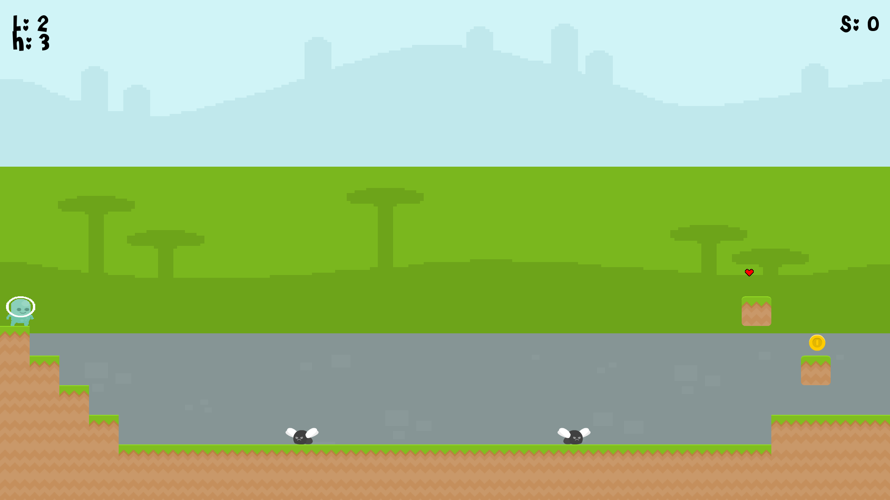

# Alien Invasion

## Description
Travel throughout multiple planets collecting coins and getting by enemies. Alien Invasion includes a total of 2 levels, the first being located on a planet named 'Earth'. In order to complete the first level, you will need to be able to complete difficult jumps and outsmart enemies. During the second level, you will travel into space to one of Jupiters 67 moons. Here, the gravity level is much lower than on the planet before so in order to collect coins, you will need to be able to accurately land long jumps and evade more enemies.

### How to play
In order to play the game...

### Controls
Move left - A

Move right - D

Jump - Space

Sprint - LShift

Close Game - Escape

### Items
Coins - If picked up, player score increases by 10.

Hearts - If picked up, player score increases by 5 and player health increases by 1. The maximum amount of hearts you can have is 5.

Slows - If picked up, player speed is decreased to 5.

### Mobs
Basic Mob - If player collides with mob, health is decreased by 1. Mob speed is set to 9.

Fast Mob - If player collides with mob, health is decreased by 1. Mob speed is set to 30.

## Screenshots
Start Screen:

In Game:

## Credits
Sounds:

All music and sound effects can be found and are free to download at https://freesound.org/ 
  
Images:

All images used in this game can be found on https://opengameart.org/

